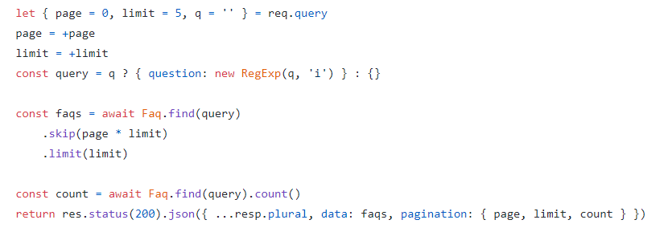

# Chill Music Nodejs

## 1. How to use this project

## 2. Business Logic

1. User

    - getAll
      
    - getOne
        - kiểm tra id có thỏa mãn hay không?
    - postOne

        - {email, password, fullname, gender, dayOfBirth}
        - kiểm tra email đã tồn tại hay chưa?
        - validate email, password, fullname, gender, dayOfBirth
        - mã hóa password

    - updateOne

        - {fullname, dayofBirth, gender}
        - validate new value

    - deleteOne
        - check id có hợp lệ hay không?
    - changePw

        - {oldPassword, newPassword}

    - forgotPassword
        - {email}

2. Song
    - getAll
    - getOne
    - postOne
        - {name, path, image, genre, artists}
    - updateOne
        - {name, path, image, genre, artists}
    - deleteOne
3. Album
    - getAll
    - getOne
    - postOne
        - {name, image, artists}
    - updateOne
        - {name, image, artists}
    - deleteOne
4. Playlist
    - getAll
    - getOne
    - postOne
        - {name}
    - updateOne
        - {name}
    - deleteOne
5. Artist

    - getAll
    - getOne
    - postOne
        - {name, avatar, banner, genre, description}
    - updateOne

        - {name, avatar, banner, genre, description}

    - deleteOne

6. HomePage
    - List Playlist
7. SearchPage
